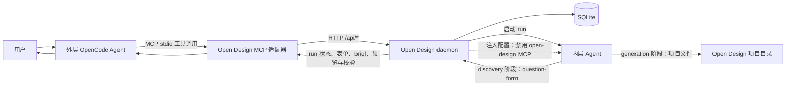
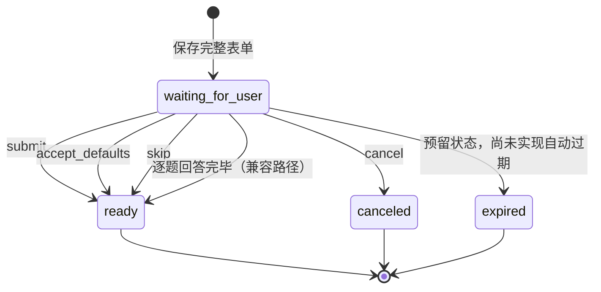
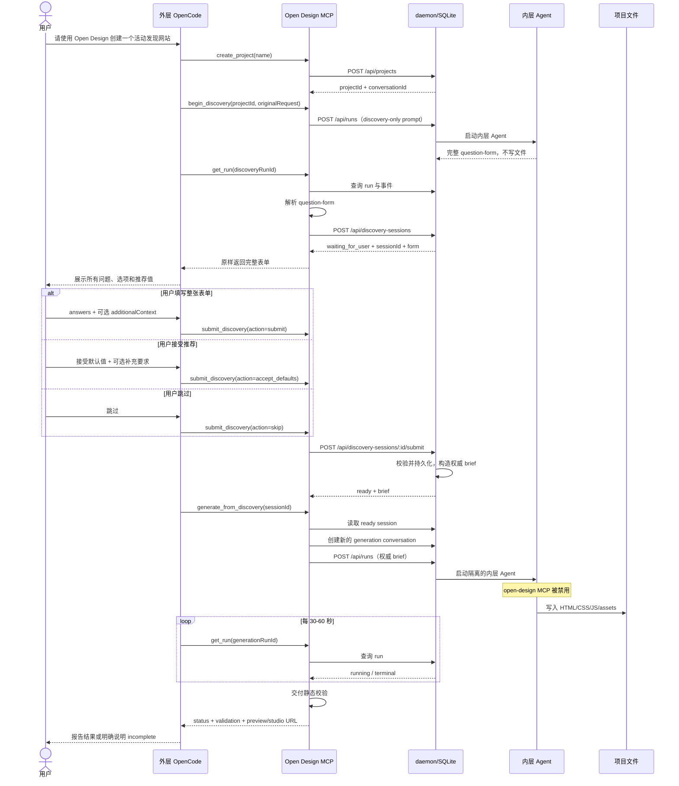

# OpenCode 接入 Open Design：方案二 实现记录

> 文档状态：实验分支实现说明  
> 对应分支：`feat/discovery-session`  
> 对比基线：`origin/main` / `506c2900b`  
> 最近核对日期：2026-08-06

## 1. 文档目的

本文记录当前“方案二”从无到有的实现过程、代码结构、运行流程、已验证能力和仍需解决的问题，便于：

- 区分 OpenCode 外层 Agent 与 Open Design 内层 Agent 的职责；
- 复现当前实现和测试；
- 后续继续开发、审查或回滚时有明确依据。

本文所说的“方案二”特指：

1. 用户向外层 Agent 提出一个模糊设计请求；
2. Open Design 内层 Agent 根据请求动态生成一张完整的 `<question-form>`；
3. 表单作为 MCP 结果返回给外层 Agent；
4. 表单和原始请求以 `sessionId` 持久化；
5. 用户可以填写整张表单、接受推荐默认值、跳过表单，也可以补充表单外要求；
6. Open Design 根据持久化后的权威 brief 启动一次新的生成任务；
7. 外层 Agent 只轮询这次任务，不重写 brief，也不自行代替 Open Design 生成文件。

方案二不是 MCP 原生 Elicitation，也不是逐题自适应访谈。逐题接口仍保留为兼容实验，但不是当前主流程。

---

## 2. 要解决的问题

### 2.1 原始问题

OpenCode 通过 MCP 调用 Open Design 时，常见流程是：

```text
用户提出需求 → create_project → start_run → 直接生成文件
```

这条路径的问题是：

- 模糊需求没有先确认产品类型、用户、页面结构、交互、视觉方向和交付形式；
- `create_project` 默认写入 `skipDiscoveryBrief: true`，用于避免内层 Agent 在自动化生成时停在 Open Design Web 专用表单上；
- 如果简单地把 `skipDiscoveryBrief` 改回 `false`，内层 Agent 虽然可能输出 `<question-form>`，但 MCP 客户端不一定能够把它当成交互表单继续同一个调用；
- 当前测试中的 OpenCode 客户端对 MCP Elicitation 返回“不支持表单 elicitation”，因此不能直接依赖协议级 Elicitation；
- 外层 Agent 和内层 Agent 是两个隔离的运行实例，即使模型名称相同，也不会天然共享交互状态。

### 2.2 当前方案的核心思路

把一次长时间、需要用户中途输入的 MCP 调用拆成多个明确的请求/响应步骤：

```text
生成表单 → 保存会话 → 用户确认 → 固化 brief → 新会话生成 → 验证交付
```

其中，Open Design 负责领域问题、状态和生成；OpenCode 负责面向用户展示结果、收集明确选择并调用下一步工具。

---

## 3. 术语和角色

| 名称 | 含义 | 当前职责 |
|---|---|---|
| 用户 | 在 OpenCode TUI 中提出需求的人 | 提需求、填写/跳过表单、补充自由文本 |
| 外层 Agent | 用户直接对话的 OpenCode Agent | 选择 MCP 工具、展示表单、转交用户明确决定、轮询结果 |
| Open Design MCP | `apps/daemon/src/mcp.ts` 暴露的 stdio MCP 适配器 | 把工具调用转成 daemon HTTP 请求，并给外层 Agent 返回结构化结果和流程提示 |
| Open Design daemon | 本地 Express + SQLite 服务 | 项目、会话、run、文件和 discovery session 的权威状态源 |
| 内层 Agent | daemon 为某次 Open Design run 启动的 Agent；当前通常也是 OpenCode | 动态生成 question-form，或在确认后生成设计文件 |
| question-form | Open Design 已有的表单标记协议 | 描述问题、选项、默认推荐、输入类型和限制 |
| discovery session | 本次新增的持久化状态 | 保存原始请求、完整表单、答案、用户动作、补充要求和状态 |
| brief | 由持久化 discovery session 确定性生成的文本 | 作为后续生成任务唯一权威需求来源 |
| run | Open Design 的异步 Agent 执行任务 | 通过 `runId` 轮询直到终态 |

“外层 Agent”和“内层 Agent”可以使用同一个模型，例如都显示 `openai/gpt-5.6-luna`，但它们仍是两个不同的 Agent 进程/会话：上下文、工具权限、工作目录和生命周期都不同。

---

## 4. 当前总体架构



关键隔离规则：外层 OpenCode 可以调用 `open-design` MCP；daemon 启动的内层 OpenCode 会显式获得：

```json
{
  "mcp": {
    "open-design": { "enabled": false }
  }
}
```

这样可以防止内层 Agent 再次调用 `open-design_start_run`，形成“Open Design → 内层 OpenCode → Open Design → 新 run”的递归嵌套。

---

## 5. OpenCode 侧做了什么

### 5.1 没有修改 OpenCode 源码

当前实现没有 fork 或修改 OpenCode 本身。OpenCode 侧的实际改动只有工作区 MCP 配置：

文件：`D:\Codexwork\demo\opencode.jsonc`

```jsonc
{
  "$schema": "https://opencode.ai/config.json",
  "mcp": {
    "open-design": {
      "type": "local",
      "enabled": true,
      "command": [
        "wsl.exe",
        "bash",
        "-lc",
        "cd /mnt/d/Codexwork/open-design && exec /home/lft/.nvm/versions/node/v24.18.0/bin/pnpm exec od mcp --daemon-url http://127.0.0.1:7457"
      ]
    }
  }
}
```

该配置使 OpenCode 在工作区启动时：

1. 通过 Windows 的 `wsl.exe` 进入 WSL；
2. 在 Open Design 仓库目录启动 `od mcp` stdio 服务；
3. 让 MCP 连接到已经运行的 daemon `http://127.0.0.1:7457`；
4. 通过 MCP `tools/list` 自动获得新增 discovery 工具。

### 5.2 外层 OpenCode 当前依赖的行为

OpenCode 不理解 Open Design 的数据库和内部状态，它只看到 MCP 工具定义、工具返回结果和 `hint`。当前主要依靠以下软约束引导它：

- 工具名称和 JSON Schema；
- 工具 `description`；
- MCP server instructions；
- `get_run` 返回的状态、`hint`、`discovery`、`deliveryValidation` 等字段。

因此，目前已经可以用普通请求触发“生成表单 → 用户确认 → 生成”的流程，但这仍不是客户端级硬状态机。模型可能因上下文、模型版本或工具选择策略而偏离流程。

### 5.3 OpenCode 侧没有实现的内容

- 没有新增 OpenCode 原生 UI 组件来直接渲染 Open Design 的 `<question-form>`；
- 没有修改 OpenCode 的 MCP Elicitation 支持；
- 没有在 OpenCode 源码中硬编码“模糊设计请求必须先 discovery”；
- 没有让 OpenCode 与内层 Agent 共享原生会话；
- 没有保证所有 MCP 客户端都以相同形式展示整张表单。

如果未来需要完全不依赖模型遵循工具描述，应在 OpenCode 客户端、插件或专用 Agent 策略层加入确定性路由，而不是继续增加用户提示词。

---

## 6. Open Design 侧实现了什么

### 6.1 共享 question-form 契约和解析器

主要文件：

- `packages/contracts/src/question-form.ts`
- `packages/contracts/src/index.ts`
- `packages/contracts/tests/question-form.test.ts`
- `apps/daemon/src/question-form-detect.ts`

新增了纯 TypeScript 的共享数据结构：

- `QuestionForm`
- `FormQuestion`
- `FormOption`
- `QuestionType`
- `ParsedQuestionForm`

解析器 `findFirstQuestionForm()` 会：

1. 在内层 Agent 的完整文本中寻找第一个 `<question-form>` 或 `<ask-question>`；
2. 要求存在完整闭合标签；
3. 支持标签内的纯 JSON或 fenced JSON；
4. 支持对象形式 `{ questions: [...] }` 和直接问题数组；
5. 规范化问题类型别名、选项、默认值和数值限制；
6. 跳过无效或空表单，不把文档中提到的标签误判为真实表单。

表单问题不是写死在 `mcp.ts` 中的。`mcp.ts` 只提供“最多五个高价值问题、输出完整合法表单”等通用约束；具体问题、选项和推荐值由内层 Agent根据当前需求动态生成。

### 6.2 discovery session 持久化

主要文件：

- `apps/daemon/src/db.ts`
- `apps/daemon/src/discovery-session.ts`
- `apps/daemon/tests/discovery-session.test.ts`

SQLite 新增表：

```sql
CREATE TABLE discovery_sessions (
  id TEXT PRIMARY KEY,
  project_id TEXT NOT NULL,
  conversation_id TEXT NOT NULL,
  status TEXT NOT NULL,
  initial_request TEXT NOT NULL DEFAULT '',
  form_json TEXT NOT NULL,
  answers_json TEXT NOT NULL,
  submission_action TEXT,
  additional_context TEXT NOT NULL DEFAULT '',
  current_question_index INTEGER NOT NULL DEFAULT 0,
  created_at INTEGER NOT NULL,
  updated_at INTEGER NOT NULL
);
```

当前会话状态：



持久化的意义是：外层 Agent 可以结束当前回答，等待用户下一轮输入；下一轮只要带上 `sessionId`，就能继续访问同一张表单和已确认答案。

### 6.3 三种完整表单提交动作

`submitDiscoveryAnswers()` 支持：

| action | 行为 |
|---|---|
| `submit` | 保存用户明确提交的 `answers` |
| `accept_defaults` | 只读取表单中已有的 `default/defaultValue`，不会把推荐值提前当作用户答案 |
| `skip` | 不保存表单答案，但保留原始请求作为生成依据 |

此外支持 `additionalContext`，用于保存表单选项之外的自由要求，例如：

```text
接受默认值，但要求生成多文件页面。
```

答案校验包括：

- 未知问题 ID 拒绝提交；
- 必答项检查；
- checkbox 必须是字符串数组；
- `maxSelections` 限制；
- radio/select/direction-cards 类型检查；
- number/range 数值检查；
- switch 布尔值检查；
- `allowCustom: false` 时拒绝选项外答案；
- `null` 表示用户明确跳过单个问题；
- 默认 `allowCustom` 未关闭时，可以提交表单选项之外的自定义内容。

### 6.4 brief 的确定性生成

`buildDiscoveryBrief()` 按固定顺序组合：

1. 表单标题；
2. 用户原始请求；
3. 用户选择的提交动作；
4. 每个已回答问题及答案；
5. `additionalContext`。

对于选项答案，brief 同时保留人类标签和机器值，例如：

```text
现代简洁（modern_minimal）
```

这避免外层 Agent 再次总结、改写或遗漏需求。生成阶段直接从 daemon 读取该 brief，而不是让外层 Agent复制一遍。

### 6.5 daemon HTTP API

主要文件：

- `apps/daemon/src/routes/discovery-sessions.ts`
- `apps/daemon/src/server.ts`

新增接口：

| 方法 | 路径 | 作用 |
|---|---|---|
| `POST` | `/api/discovery-sessions` | 保存完整表单和原始请求 |
| `GET` | `/api/discovery-sessions/:id` | 获取会话、当前问题和 ready brief |
| `POST` | `/api/discovery-sessions/:id/submit` | 整张表单提交、接受默认值或跳过 |
| `POST` | `/api/discovery-sessions/:id/answer` | 逐题回答兼容接口 |
| `POST` | `/api/discovery-sessions/:id/cancel` | 取消会话 |

错误语义：

- `DISCOVERY_NOT_FOUND` → HTTP 404；
- `DISCOVERY_INVALID_ANSWERS` → HTTP 400；
- 状态不允许或逐题顺序错误 → HTTP 409。

### 6.6 MCP 工具

主要文件：`apps/daemon/src/mcp.ts`

当前新增或扩展的 discovery 工具：

| MCP 工具 | 作用 | 主流程是否使用 |
|---|---|---|
| `begin_discovery` | 启动 discovery-only 内层 run，让内层 Agent动态生成完整 question-form | 是 |
| `start_discovery` | 手工把完整表单保存成 session | 自动持久化前的接口；现仍保留 |
| `get_discovery` | 查询持久化会话 | 是，可用于恢复/诊断 |
| `submit_discovery` | 提交整张表单、接受默认值或跳过 | 是 |
| `generate_from_discovery` | 从 daemon 中的 ready brief 启动一次新 generation run | 是 |
| `answer_discovery` | 一次回答一个问题 | 否，兼容实验 |
| `cancel_discovery` | 取消 discovery session | 可选 |

`begin_discovery` 给内层 Agent 的通用要求包括：

- discovery-only，不写文件；
- 只返回一张完整 `<question-form>`；
- 最多五个高价值问题；
- 可提供推荐默认值，但不能声称用户已经接受；
- 问题和选项随用户请求动态生成。

### 6.7 完成 run 后自动识别并保存表单

`get_run` 在 discovery run 成功后会：

1. 从 run 的 SSE 事件中重组内层 Agent 文本；
2. 使用共享解析器查找完整 question-form；
3. 以 `run-<runId>` 作为确定性 session ID；
4. 自动保存表单、项目、conversation 和原始请求；
5. 把 `questionForm` 与 `discovery` 一起返回外层 Agent；
6. 重复轮询时读取同一 session，避免重复创建。

因此，当前推荐主流程不需要外层 Agent再手工调用 `start_discovery`。

### 6.8 从确认后的 discovery 生成

`generate_from_discovery` 会：

1. 读取 session；
2. 要求其状态必须是 `ready`；
3. 从 daemon 读取权威 brief；
4. 为生成阶段创建一个新的 Open Design conversation；
5. 要求内层 Agent不再 discovery、不重新提问、不改写 brief；
6. 要求所有文件写入当前项目目录，并使用项目相对路径；
7. 调用一次 `startRun()`，返回新的 `runId`。

使用新 conversation 很重要：discovery Agent 的上下文包含“只生成表单、禁止写文件”等指令。如果直接恢复同一个内层会话，可能把 discovery-only 状态带入生成阶段，最终 run 成功但不产生文件。

### 6.9 防止内层 Agent递归调用 Open Design MCP

主要文件：

- `apps/daemon/src/mcp-config.ts`
- `apps/daemon/src/server.ts`
- `apps/daemon/tests/mcp-config.test.ts`

daemon 为内层 OpenCode 生成临时配置时，会把 `open-design` MCP 显式禁用。显式禁用会覆盖 OpenCode 用户全局配置中同名的已启用服务器。

这解决了之前出现的嵌套问题：内层 Agent本应写文件，却把任务再次委托给 Open Design，导致额外 `start_run`、长时间轮询、runId 混乱和空交付。

### 6.10 生成完成后的交付保护

主要文件：

- `apps/daemon/src/mcp.ts`
- `apps/daemon/src/runtimes/json-event-stream.ts`
- `apps/daemon/tests/mcp-runs.test.ts`
- `apps/daemon/tests/runtimes/json-event-stream.test.ts`

当前保护包括：

1. OpenCode 工具失败状态会被规范化为 `tool_result` 且 `isError: true`，避免文件写入失败却被当作成功；
2. run 结束但仍有未完成工作且无预览文件时，MCP 将状态改为 `incomplete`；
3. HTML 静态交付会进行轻量检查：
   - 入口 HTML 是否存在；
   - HTML 是否过薄、是否有基本语义结构；
   - 本地 CSS/JS/资源引用是否存在；
   - 是否完全没有样式；
   - CSS 是否只有 `:root` 变量、没有实际渲染规则；
4. 校验失败时不允许外层 Agent报告“生成成功”；
5. 成功时返回 `previewUrl`、`studioUrl`、`agentMessage` 和 `deliveryValidation`。

该验证是静态启发式检查，不是浏览器截图或视觉验收。当前最多遍历 40 个相关文件、引用深度 2，且主要针对 HTML 交付。

---

## 7. 完整运行流程

### 7.1 时序图



### 7.2 推荐工具调用顺序

```text
create_project
  → begin_discovery
  → get_run（直到返回 discovery.session）
  → 向用户展示完整 form 并停止当前轮
  → submit_discovery
  → generate_from_discovery
  → get_run（只轮询返回的同一个 runId）
  → 检查 deliveryValidation
  → 交付 studioUrl / previewUrl / 文件列表
```

### 7.3 示例：提交表单外要求

```json
{
  "sessionId": "run-79309e96-836c-4255-9322-05788af289d5",
  "action": "accept_defaults",
  "additionalContext": "此外，我希望生成多文件页面，入口为 index.html，并拆分共享 CSS 和 JavaScript。"
}
```

不应让外层 Agent把这段内容自行改写成另一个 brief；下一步只传 `sessionId`：

```json
{
  "sessionId": "run-79309e96-836c-4255-9322-05788af289d5"
}
```

---

## 8. 从零启动和验证

### 8.1 构建修改后的包

在 WSL 中：

```bash
cd /mnt/d/Codexwork/open-design
pnpm --filter @open-design/contracts build
pnpm --filter @open-design/daemon build
```

`build` 是编译，不是启动 daemon。

### 8.2 启动 daemon

```bash
cd /mnt/d/Codexwork/open-design

OD_ALLOWED_ORIGINS=http://localhost:7458,http://127.0.0.1:7458,http://172.20.203.27:7458 \
pnpm --filter @open-design/daemon exec node dist/cli.js --no-open --port 7457
```

看到以下输出表示进程正在前台正常运行，不是卡住：

```text
[od] listening on http://127.0.0.1:7457
```

健康检查：

```bash
curl http://127.0.0.1:7457/api/health
```

### 8.3 可选：启动 Open Design Web

另开一个 WSL 终端：

```bash
cd /mnt/d/Codexwork/open-design
OD_PORT=7457 pnpm --filter @open-design/web dev --hostname 0.0.0.0 --port 7458
```

### 8.4 启动外层 OpenCode

确认工作区 `opencode.jsonc` 已配置 `open-design` MCP，然后：

```bash
cd /mnt/d/Codexwork/demo
opencode
```

在 OpenCode 侧应看到：

```text
open-design Connected
```

并能列出：

- `begin_discovery`
- `submit_discovery`
- `generate_from_discovery`
- `get_discovery`
- `get_run`

### 8.5 小型聚焦测试

按“只测相关能力”的原则，当前推荐以下测试：

```bash
cd /mnt/d/Codexwork/open-design/packages/contracts
pnpm exec vitest run tests/question-form.test.ts

cd /mnt/d/Codexwork/open-design/apps/daemon
pnpm exec vitest run -c vitest.config.ts \
  tests/discovery-session.test.ts \
  tests/mcp-runs.test.ts

pnpm exec vitest run -c vitest.config.ts \
  tests/mcp-config.test.ts \
  tests/runtimes/json-event-stream.test.ts
```

2026-08-06 当前分支实测结果：

| 测试文件 | 通过数 |
|---|---:|
| `question-form.test.ts` | 4 |
| `discovery-session.test.ts` | 9 |
| `mcp-runs.test.ts` | 37 |
| `mcp-config.test.ts` | 87 |
| `json-event-stream.test.ts` | 51 |
| **合计** | **188** |

其中新增了一条不调用真实模型的小型主流程测试，覆盖：内层 Agent 文本中的完整 question-form 解析、SQLite 保存、接受默认推荐、保存表单外补充要求、关闭并重开数据库，以及最终权威 brief 的还原。

这些是聚焦测试，不等于全仓验收。合并或正式交付前仍应运行 package typecheck、daemon typecheck 和带真实 daemon/run 边界的端到端测试。

---

## 9. 实现提交时间线

| 提交 | 内容 | 作用 |
|---|---|---|
| `b879ee8b8` | 初期 discovery MCP 实验检查点 | 保存第一次试验 |
| `b878f1c6e` | 恢复原始 MCP adapter | 撤销已验证不合适的临时实现，重新从干净基线开发 |
| `0f4d5062a` | 共享 question-form 解析器 | daemon 与其他层使用同一完整表单契约 |
| `c0f4c7b5a` | discovery route 接入检查点 | 把新路由挂入 server |
| `d902fc3ea` | 内层 OpenCode 隔离 Open Design MCP | 防止递归 start_run |
| `38ed52e2c` | discovery session 持久化 | SQLite、状态机、路由和初版 MCP 工具 |
| `d82943a39` | 灵活整表提交 | submit / accept_defaults / skip / additionalContext |
| `29d5bbcea` | run 完成后自动持久化表单 | get_run 自动解析并保存 session |
| `b7b9ee81e` | 生成交付加固 | 新 generation conversation、相对路径约束、工具错误识别、空交付保护 |
| `2273e170b` | 静态网页交付验证 | 入口、引用、HTML 结构和 CSS 有效性检查 |

相对 `origin/main`，当前分支方案相关净变化为：15 个文件，约 2292 行新增、16 行删除。

---

## 10. 当前已达到的能力

当前已通过代码和实际调用验证：

- OpenCode 可通过本地 MCP 连接 Open Design；
- 内层 Agent能针对不同请求动态生成完整 question-form，不依赖写死问题；
- 表单可跨 OpenCode 对话轮次持久化；
- 可整表提交、接受默认值或跳过；
- 可接受表单外自由补充要求；
- 默认推荐在用户确认前不会被记录为答案；
- brief 由 daemon 根据持久化数据确定性生成；
- 生成阶段使用新 conversation，不继承 discovery-only 内层上下文；
- 内层 OpenCode 不再继承外层的 `open-design` MCP；
- 生成阶段只需传 `sessionId`，外层 Agent无需复制 brief；
- 可以生成单文件或多文件静态网页；
- run 成功但没有文件、存在失败工具结果或 CSS 实质为空时，不再直接报告成功；
- 成功结果可以返回 Open Design studio、原始预览和源文件。

对于普通用户请求，已经不必再输入此前那种九条规则式复杂提示词。但是“不依赖复杂用户提示词”不等于“不依赖任何 Agent 指令”：当前流程规则仍存在于 MCP 工具描述、server instructions、`hint` 和 daemon 生成 prompt 中。

---

## 11. 尚未完成或需要修正的部分

### 11.1 MCP instructions 存在一处流程矛盾

当前 `begin_discovery` 工具说明和 `get_run` 行为已经是“成功后自动保存 session”，但 MCP server instructions 仍有旧表述：

```text
Poll that run with get_run, parse its question-form, then call start_discovery(...)
```

正常主流程实际上不应再手工调用 `start_discovery`。该文字应统一，否则外层 Agent可能重复保存表单。

### 11.2 生成不是全局幂等

`generate_from_discovery` 每次调用只启动一个 run，但同一个 ready `sessionId` 被重复调用时，当前仍可能启动多个 generation run。应在 session 中记录 generation runId 或使用原子 claim，保证同一 session 真正“最多生成一次”，除非用户明确要求重试。

### 11.3 原始请求跨 MCP 进程重启的可靠性不足

`begin_discovery` 暂时使用进程内 `pendingDiscoveryRuns` 保存原始请求。若 stdio MCP 在 discovery run 完成前重启，map 会丢失；后备 `status.currentPrompt` 可能包含包装后的 discovery 指令，而非用户原话。

建议把 `runId → initialRequest` 在启动时直接持久化到 daemon，而不是依赖 MCP 进程内存。

### 11.4 OpenCode 端仍是软编排

当前没有修改 OpenCode 客户端。外层 Agent是否先调用 discovery、是否原样展示表单，仍取决于模型对工具描述的遵循。

要获得不同 Agent/客户端一致的行为，可以选择：

1. 在 OpenCode 插件/客户端层增加确定性 discovery 路由和表单适配；
2. 客户端支持后改用 MCP Elicitation；
3. 保留方案二，但由 Open Design MCP 返回更强的结构化状态，并减少需要外层 Agent解释的自由度。

### 11.5 尚未完成 Web UI 与 CLI 对等入口

当前新增的是 daemon HTTP + MCP 能力。还没有：

- Open Design Web 中用于查看/恢复这些独立 discovery session 的新页面；
- 对应 `od discovery ...` CLI 子命令。

按照仓库的 capability exposure 规范，若要作为正式用户能力合入，应补齐 UI/CLI 或明确说明为什么该能力仅属于内部 MCP 适配层。

### 11.6 `expired` 仅为预留状态

状态类型中存在 `expired`，但当前没有自动过期任务、过期时间或恢复策略。

### 11.7 静态交付验证不是视觉验收

当前验证能发现“入口不存在”“CSS 只有变量”“本地依赖丢失”等问题，但不能判断：

- 页面实际是否错位；
- 响应式断点是否符合设计；
- 点击交互是否有效；
- 浏览器是否出现运行时异常；
- 视觉质量是否达到预期。

正式验收应增加小型浏览器 smoke test，例如打开入口、检查控制台错误、截图桌面和移动视口，并验证主要导航。

### 11.8 需要补充真正的端到端自动测试

目前测试覆盖了组件和 MCP handler，但还缺一条完整自动化链路：

```text
模糊请求
→ 动态 question-form
→ 持久化
→ 用户提交/接受默认/跳过
→ generate_from_discovery
→ 文件生成
→ deliveryValidation=valid
```

---

## 12. 方案二

| 方案 | 谁提出问题 | 如何呈现 | 状态由谁维护 | 当前状态 |
|---|---|---|---|---|
| MCP Elicitation（此前方案一） | Open Design/MCP server | 客户端原生表单 | MCP client/server 协议 | 当前 OpenCode 测试显示不支持；未采用 |
| 方案二 | Open Design 内层 Agent动态生成完整表单 | 外层 Agent一次展示整张表单 | Open Design daemon + sessionId |


方案二的重点不是模仿 Open Design Web 每一屏的交互动画，而是先建立可靠的“表单—确认—brief—生成”状态闭环。

---

## 13. 建议的下一步开发顺序

1. 修正 MCP instructions 中“自动持久化”和“手工 start_discovery”的矛盾；
2. 为 `generate_from_discovery` 增加 session 级幂等和明确重试语义；
3. 将 `runId → initialRequest` 移入 daemon 持久化；
4. 增加一条小型端到端测试，不使用真实大模型时可用 mock run 事件；
5. 加入轻量浏览器 smoke test 验证入口、CSS、控制台和基本导航；
6. 决定正式产品路径：继续方案二，还是在 OpenCode 端补 Elicitation/原生表单支持；
7. 若准备合入上游，补齐 CLI/UI 暴露、文档和全量 typecheck。

---

## 14. 交付与排查速查

### 14.1 生成文件位置

daemon 管理的项目通常位于：

```text
<Open Design data root>/projects/<projectId>/
```

当前本地开发数据根使用仓库内 `.od` 时，例如：

```text
D:\Codexwork\open-design\.od\projects\weekend-city-discovery\
```

### 14.2 不要混淆的三个 ID

| ID | 示例 | 用途 |
|---|---|---|
| `projectId` | `weekend-city-discovery` | 定位项目和文件 |
| discovery `sessionId` | `run-add62812-...` | 表单确认与生成 handoff |
| generation `runId` | `53b54a86-...` | 轮询一次异步生成任务 |

### 14.3 判断成功的最低条件

不能只看 daemon 原始 `status: succeeded`。至少还应确认：

- `previewUrl` 或明确的入口文件存在；
- `deliveryValidation.status === "valid"`，或非 HTML 交付明确为 `not_applicable`；
- `list_files` 能看到预期文件；
- 没有未处理的工具错误；
- 浏览器能实际打开入口。

---

## 15. 结论

当前方案二已经完成了核心工程闭环：

```text
动态需求表单
→ sessionId 持久化
→ 用户明确确认/默认/跳过/补充
→ daemon 生成权威 brief
→ 隔离的新内层 Agent生成
→ 交付完整性检查
```

它解决了“Open Design Web 有 question-form，但外接 Agent直接生成且无法维护用户确认状态”的主要问题，也避免了外层与内层 OpenCode 递归调用同一个 Open Design MCP。

但它目前仍属于实验分支能力，而不是已经产品化的通用多轮对话协议。最重要的剩余工作是生成幂等、原始请求持久化、客户端确定性编排、UI/CLI 对等入口和真正端到端验收。
